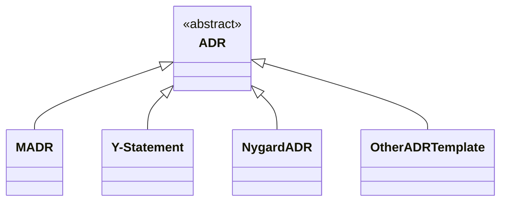

A "lightweight" ADR consists of [title, status, context, decision, and consequences](https://github.com/joelparkerhenderson/architecture-decision-record/blob/main/locales/en/templates/decision-record-template-by-michael-nygard/index.md) according to [@mtnygard](https://github.com/mtnygard). <!-- From Nygard post: "Context This section describes the forces at play, including technological, political, social, and project local." -->
We think that the *considered options* with their pros and cons are also crucial to understand the reason of a chosen option. [MADR](https://adr.github.io/madr/). Therefore, the Markdown Architectural Decision Records (MADR) projec includes such tradeoff analysis information. It also adds additional metadata such as decision makers and confirmation.

The relation of the MADR, Nygardian ADR structure, Y-Statements, and other templates is shown in the following UML class diagram:

### MADR

MADR is about architectural decisions that [matter `[ˈmæɾɚ]`](https://en.wiktionary.org/wiki/matter#Pronunciation). The project provides a [full](https://github.com/adr/madr/blob/4.0.0/template/adr-template.md?plain=1) and a [minimal](https://github.com/adr/madr/blob/4.0.0/template/adr-template-minimal.md?plain=1) template, both of which now come in an annotated and a bare format. Rationale for this decision is available [here](https://github.com/adr/madr/tree/4.0.0/template#decisions).

### Y-Statement

In short, the Y-statement is as follows:

> In the context of `<use case/user story u>`, facing `<concern c>` we decided for `<option o>` to achieve `<quality q>`, accepting `<downside d>`.

The long form of it is as follows (extra section "because"):

> In the context of `<use case/user story u>`,
> facing `<concern c>`
> we decided for `<option o>`
> and neglected `<other options>`,
> to achieve `<system qualities/desired consequences>`,
> accepting `<downside d/undesired consequences>`,
> because `<additional rationale>`.

cards42 has adopted the Y-statement template in its German [ADR card](https://cards42.org#adr); the English version is similar, but adds state information.
Finally, you can find more explanations and examples on Medium: [Y-Statements - A Light Template for Architectural Decision Capturing](https://medium.com/@docsoc/y-statements-10eb07b5a177).

### Other ADR templates

Numerous other ADR formats exist, many of which are featured in [@joelparkerhenderson's GitHub repository](https://github.com/joelparkerhenderson/architecture_decision_record).

Moreover, [42010 architecture description (AD) template](http://www.iso-architecture.org/42010/templates/) for [ISO/IEC/IEEE 42010:2011](https://en.wikipedia.org/wiki/ISO/IEC_42010), the international standard for architecture descriptions of systems and software, suggests nine information items for ADRs its Appendix A. It also identifies areas to consider when identifying key decisions.
