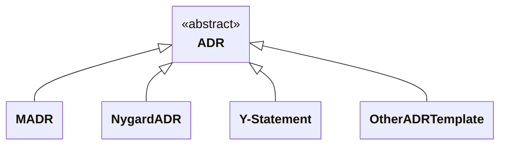

The following UML class diagram shows that many templates for ADR capturing exist, including (but not limited to) MADR, Nygardian ADRs, and Y-Statements:

### Markdown Architectural Decision Records (MADR)

MADR is about architectural decisions that *matter* ([`[ˈmæɾɚ]`](https://en.wiktionary.org/wiki/matter#Pronunciation)). You can read more about MADR [here](https://www.ozimmer.ch/practices/2022/11/22/MADRTemplatePrimer.html). You can use MADR without installing software by populating the template in any text editor. Additionally, a [VS Code extension](https://marketplace.visualstudio.com/items?itemName=StevenChen.vscode-adr-manager) is available, though it may be outdated and lack support for the latest features. [Other tools](https://adr.github.io/adr-tooling/#madr-template) are also available.

MADR provides a [full](https://github.com/adr/madr/blob/4.0.0/template/adr-template.md?plain=1) and a [minimal](https://github.com/adr/madr/blob/4.0.0/template/adr-template-minimal.md?plain=1) template, both of which now come in an annotated and a bare format. Rationale for this decision is available [here](https://github.com/adr/madr/tree/4.0.0/template#decisions).

We think that the *considered options* with their pros and cons are crucial to understand the reasons for choosing a particular design. Therefore, the [Markdown Architectural Decision Records (MADR)](https://adr.github.io/madr/) project in this organization includes such tradeoff analysis information. It also suggests metadata such as decision makers and confirmation in addition to decision status.

### Nygard ADR

An ADR consists of title, status, context, decision, and consequences according to "Documenting Architecture Decisions" by [@mtnygard](https://github.com/mtnygard). <!-- From the Nygard post: "Context This section describes the forces at play, including technological, political, social, and project local." and "We should use a lightweight text formatting language like Markdown or Textile." -->

The blog post from 2011 that suggests this structure is [here](https://cognitect.com/blog/2011/11/15/documenting-architecture-decisions) and a Markdown rendering of it is available [here](https://github.com/joelparkerhenderson/architecture-decision-record/blob/main/locales/en/templates/decision-record-template-by-michael-nygard/index.md).

### Y-Statement

In short, the Y-statement is as follows:

> In the context of `<use case/user story>`, facing `<concern>` we decided for `<option>` to achieve `<quality>`, accepting `<downside>`.

The long form of it is as follows (extra section "because"):

> In the context of `<use case/user story>`,
> facing `<concern>`,
> we decided for `<option>`
> and neglected `<other options>`,
> to achieve `<system qualities/desired consequences>`,
> accepting `<downside/undesired consequences>`,
> because `<additional rationale>`.

cards42 has adopted the Y-statement template in its German [ADR card](https://cards42.org#adr); the English version is similar, but adds state information.
Finally, you can find more explanations and examples on Medium: [Y-Statements - A Light Template for Architectural Decision Capturing](https://medium.com/@docsoc/y-statements-10eb07b5a177).

### Other ADR templates

Numerous other ADR formats exist, many of which are also featured in [@joelparkerhenderson's GitHub repository](https://github.com/joelparkerhenderson/architecture_decision_record).

The [template](http://www.iso-architecture.org/42010/templates/) for [ISO/IEC/IEEE 42010:2011](https://en.wikipedia.org/wiki/ISO/IEC_42010), the international standard for architecture descriptions of systems and software emgineering, suggests nine information items for ADRs its Appendix A. It also identifies areas to consider when identifying key decisions.
