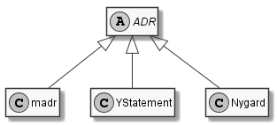

# Architectural Decision Records (ADRs)

An [Architectural Decision (AD)](https://en.wikipedia.org/wiki/Architectural_decision) is a justified design choice that addresses a functional or non-functional requirement that is architecturally significant.
An [Architecturally Significant Requirement (ASR)](https://en.wikipedia.org/wiki/Architecturally_significant_requirements) is a requirement that has a measurable effect on the architecture and quality of a software and/or hardware system.
An *Architectural Decision Record (ADR)* captures a single AD and its rationale. ADR can help you understand the reasons for a chosen architectural decision, along with its trade-offs and consequences. 
The collection of ADRs created and maintained in a project constitute its *decision log*.
All these are within the topic of Architectural Knowledge Management (AKM), but ADR usage can be extended to design and other decisions ("any decision record").

The aim of the [GitHub adr organization](http://github.com/adr) is to:

1. Motivate the need for and benefits of AD capturing and establish a common vocabulary.
2. Strengthen the tooling around ADRs, in support of agile practices as well as iterative and incremental engineering processes.
3. Provide pointers to public knowledge in the context of AKM and ADRs.

<!-- > Note: The term "architecture decision record" can be used interchangeably. -->

The repository for the Website of the ADR organization is [https://github.com/adr/adr.github.io](https://github.com/adr/adr.github.io).

## ADRs in the Media

- [Love Unrequited: The Story of Architecture, Agile, and How Architecture Decision Records Brought Them Together](https://ieeexplore.ieee.org/document/9801811), Michael Keeling in the Pragmatic Designer column of IEEE Software Vol. 39 Issue 4 (2022) ([PDF](https://ieeexplore.ieee.org/stamp/stamp.jsp?arnumber=9801811))
- Chapter 3 of ["Patterns for API Design: Simplifying Integration with Loosely Coupled Message Exchanges"](https://api-patterns.org/book/) in the Addison Wesley Signature Series at Pearson features six narratives guiding through the conceptual level of API design: 29 recurring decisions with  options and criteria. Learn more in this [blog post](https://medium.com/nerd-for-tech/api-patterns-website-redesigned-and-sample-book-chapter-available-df9daf4b5e15).
- Architectural decision capturing is positioned as one of the essential activities in [Design Practice Reference](https://leanpub.com/dpr), a LeanPub e-Book.
- (German) [Gut dokumentiert: Architecture Decision Records](https://www.heise.de/hintergrund/Gut-dokumentiert-Architecture-Decision-Records-4664988.html) by [@obfischer](https://github.com/obfischer) published at [heise online](https://www.heise.de/).

{: .long}
<!-- markdownlint-disable-next-line MD022 -->
## Suggested ADR Templates

We recommend that you adapt Markdown Architecture Decision Records (MADR) templates. You can use MADR without installing any software, as the template can be populated in any text editor. However, there is [a VS Code extension](https://marketplace.visualstudio.com/items?itemName=StevenChen.vscode-adr-manager) that can assist you, among other tools. You can read more about MADR [here](https://www.ozimmer.ch/practices/2022/11/22/MADRTemplatePrimer.html). Currently, we have four variants of MADR templates, which you can find and use [here](https://github.com/adr/madr/tree/develop/template). Each variant can accommodate different types of details.

## Relation of ADRs, MADR, and Others

## Sustainable Architectural Decisions

We base our work on the guidelines and principles in [Sustainable Architectural Decisions](https://www.infoq.com/articles/sustainable-architectural-design-decisions) by Zdun et al., for instance the Y-statement format suggested in that article.
However, we are open to other formats of ADRs as shown at [@joelparkerhenderson's repository](https://github.com/joelparkerhenderson/architecture_decision_record).

In short, the Y-statement is as follows:

> In the context of `<use case/user story u>`, facing `<concern c>` we decided for `<option o>` to achieve `<quality q>`, accepting `<downside d>`.

The long form of it is as follows (extra section "because"):

> In the context of `<use case/user story u>`,
> facing `<concern c>`
> we decided for `<option o>`
> and neglected `<other options>`,
> to achieve `<system qualities/desired consequences>`,
> accepting `<downside d/undesired consequences>`,
> because `<additional rationale>`.

You can find more explanations and examples on Medium [Y-Statements - A Light Template for Architectural Decision Capturing](https://medium.com/@docsoc/y-statements-10eb07b5a177).

[A Definition of Done for Architectural Decision Making](https://www.ozimmer.ch/practices/2020/05/22/ADDefinitionOfDone.html) proposes five criteria and a checklist to decide when it is time to set the status of a single decision to "done": evidence, criteria and alternatives, agreement, documentation, and realization/review plan. Here, we focus on the 'D' in *ecADR*.

## Collection of ADR Templates for Various Contexts

- Overview: [Architectural Decision Records](https://github.com/joelparkerhenderson/architecture_decision_record): collection of markdown templates converted to Markdown
- Comparison of seven templates: [Architectural Decision Guidance Across Projects - Problem Space Modeling, Decision Backlog Management and Cloud Computing Knowledge](https://www.ost.ch/fileadmin/dateiliste/3_forschung_dienstleistung/institute/ifs/cloud-application-lab/admentor-wicsa2015ubmissionv11nc.pdf). WICSA 2015: 85-94.
- [DecisionCapture](https://schubmat.github.io/DecisionCapture/): Templates for agile projects and explanation of the ADR universe, with [example](https://github.com/schubmat/DecisionCapture/blob/master/samples/samples_merged/samples_simpleTemplate_secondSprint.md).
- cards42 has adopted the Y-statement template in its German [ADR card](https://cards42.org#adr); the English version is similar, but adds state information.
- The [template](http://www.iso-architecture.org/42010/templates/) for [ISO/IEC/IEEE 42010:2011](https://en.wikipedia.org/wiki/ISO/IEC_42010), the international standard for architecture descriptions of systems and software, suggests nine information items for ADRs its Appendix A. It also identifies areas to consider when identifying key decisions.

## Good ADRs (and how to get to them)

- [How to create ADRs — and how not to](https://www.ozimmer.ch/practices/2023/04/03/ADRCreation.html) collects good practices and anti-patterns
- [Architectural Significance Test and Some Core Decisions](https://www.ozimmer.ch/practices/2020/09/24/ASRTestECSADecisions.html)
- [The Markdown ADR (MADR) Template Explained and Distilled](https://www.ozimmer.ch/practices/2022/11/22/MADRTemplatePrimer.html)
- Proposal for [A Definition of Done for Architectural Decision Making](https://www.ozimmer.ch/practices/2020/05/22/ADDefinitionOfDone.html)
- [How to review ADRs — and how not to](https://www.ozimmer.ch/practices/2023/04/05/ADRReview.html) has good practices, anti-patterns, review check list

## Decision Capturing Tools

*Disclaimer:*
The following list is rather inclusive.
Please find out about the status and the maturity of the list entries for yourself by following the links.
We are happy to include more candidate assets here.

- [adr-manager](https://adr.github.io/adr-manager/#/): Craft MADR 2.x templates directly in the Web Browser.
- [adr-tools](https://github.com/npryce/adr-tools) - bash scripts to manage ADRs in the [Nygard format](https://cognitect.com/blog/2011/11/15/documenting-architecture-decisions.html). [example](https://github.com/npryce/adr-tools/blob/master/doc/adr/0002-implement-as-shell-scripts.md).
  - Ansible script to install adr-tools: [ansible-adr-tools](https://github.com/escalate/ansible-adr-tools)
  - C# rewrite: [adr-cli](https://github.com/GingerTommy/adr-cli)
  - Go rewrite: [adr](https://github.com/marouni/adr)
  - Java rewrite: [adr-j](https://github.com/adoble/adr-j)
  - ESM Node.js port: [adr-tools](https://github.com/meza/adr-tools)
  - Node.js rewrite: [adr](https://github.com/phodal/adr)
  - PHP version: [phpadr](https://github.com/globtec/phpadr)
  - Powershell module: [adr-ps](https://github.com/rdagumampan/adr-ps)
  - Python rewrite: [adr-tools-python](https://pypi.org/project/adr-tools-python/)
  - Another Powershell module: [ArchitectureDecisionRecords](https://github.com/ajoberstar/ArchitectureDecisionRecords)
  - Rust rewrite: [adrs](https://github.com/joshrotenberg/adrs)
- [adr-plugin](https://github.com/backstage/community-plugins/tree/main/workspaces/adr/plugins/adr) - plugin to explore and search ADRs within a backstage based developer portal. Search at scale across mutliple orgs/repos.
- [adr-viewer](https://github.com/mrwilson/adr-viewer) - python application to generate a website from a set of ADRs.
- [architectural-decision](https://github.com/cspray/architectural-decision): PHP library to create ADRs using PHP8 Attributes.
- [dotnet-adr](https://github.com/endjin/dotnet-adr) - A cross platform .NET Global Tool for creating and managing Architectural Decision Records (ADR).
- [Embedded Architectural Decision Records](https://github.com/adr/e-adr#embedded-architectural-decision-records), which shows how a distributed AD log can be embedded in Java Code via ADR annotations.
- [Log4brains](https://github.com/thomvaill/log4brains): CLI and web UI to log and publish your ADRs as a static website. Currently in [low maintenance mode](https://github.com/thomvaill/log4brains/discussions/108#discussioncomment-7607483).
- [Loqbooq](https://loqbooq.app): Web App with Slack integration to record ADR-inspired decision logs
- [Talo](https://github.com/canpolat/talo): CLI (and dotnet tool) to manage and export ADRs, RFCs and custom software design document types.

For a more detailed list for tooling for MADR, please head to <https://adr.github.io/madr/tooling.html>.

### Tooling related to architecture management

- [ArchUnit](https://github.com/TNG/ArchUnit): unit tests for architecture
- [docToolchain](https://doctoolchain.github.io/docToolchain/): docToolchain is an implementation of the [docs-as-code](http://www.writethedocs.org/guide/docs-as-code/) approach for software architecture plus some additional automation.
- [Structurizr](https://www.structurizr.com/): Structurizr is a collection of tooling to help you visualise, document and explore your software architecture using the [C4 model](https://c4model.com/).

### Interesting, but unmaintained tooling

- [adr-log](https://github.com/adr/adr-log): Generates an architectural decision log out of MADRs.
- [ADMentor](https://github.com/IFS-HSR/ADMentor) Architectural Decision Modeling Add-In for [Sparx Enterprise Architect](https://www.sparxsystems.de/uml/neweditions/)
- [eadlsync](https://adr.github.io/eadlsync/): Synchronizes embedded architectural decision records with a repository of architectural decisions.
- [SE Repo](https://github.com/adr/serepo): Software Engineering Repository. A repository for versioning software engineering artifacts, which can be architectural decisions, patterns, and others.

## More Information

- ["An Adoption Model for Architectural Decision Making and Capturing"](https://www.ozimmer.ch/practices/2023/04/21/ADAdoptionModel.html)
- [Architectural Decisions — The Making Of](https://www.ozimmer.ch/practices/2020/04/27/ArchitectureDecisionMaking.html) - provides some history on architecture decision records.
- [Architectural Decision Records (ADR): Open & Transparent Decision History](https://openpracticelibrary.com/practice/architectural-decision-records-adr/) in the Open Practice Library
- An AWS Prescriptive Guidance recommends [using architectural decision records to streamline technical decision-making for a software development project](https://docs.aws.amazon.com/prescriptive-guidance/latest/architectural-decision-records/welcome.html).
- [Architectural Knowledge Management (AKM) overview](https://www.ost.ch/de/forschung-und-dienstleistungen/informatik/ifs-institut-fuer-software/labs/cloud-application-lab/architectural-knowledge-management-akm) at OST
- [Documenting Architecture Decisions](https://cognitect.com/blog/2011/11/15/documenting-architecture-decisions.html) by Michael Nygard
- [Architecture Decision Records in Action by Michael Keeling (IBM Watson Group) and Joe Runde (IBM) [YouTube]](https://www.youtube.com/watch?v=41NVge3_cYo) - presentation including empirical numbers.
- [Documenting Architecture Decisions](https://www.fabian-keller.de/blog/documenting-architecture-decisions) - Blog entry by Fabian Keller
- [From Architectural Decisions to Design Decisions](https://medium.com/olzzio/from-architectural-decisions-to-design-decisions-f05f6d57032b) and [ADR = Any Decision Record?](https://medium.com/olzzio/adr-any-decision-record-916d1b64b28d) - two blog posts by Olaf Zimmermann proposing to extend the scope of ADRs.
- Method selection and tailoring in DPR, the [Design Practice Repository (DPR)](https://socadk.github.io/design-practice-repository/) on GitHub and the [Design Practice Reference](https://leanpub.com/dpr), a corresponding LeanPub e-Book. Architectural decision capturing is positioned as one of the essential activities in DPR.
- [Decision-making ADRs: weightings are a work-around](https://jacquiread.com/posts/2024-09-11-decision-making-adrs-weightings-are-a-workaround/) is a blog post by Jacqui Read that offers some tips on how to make better ADRs.
- [ADRs and Architecture Stories](https://www.developertoarchitect.com/lessons/lesson168.html) is a short video series by Mark Richards explaining ADRs.

<!-- - [Work by Daniel Popescu](https://scholar.google.com/citations?user=dASv28sAAAAJ) -->

## Contribute

To improve this page, head to <https://github.com/adr/adr.github.io>, edit `index.md`, and submit a pull request.
