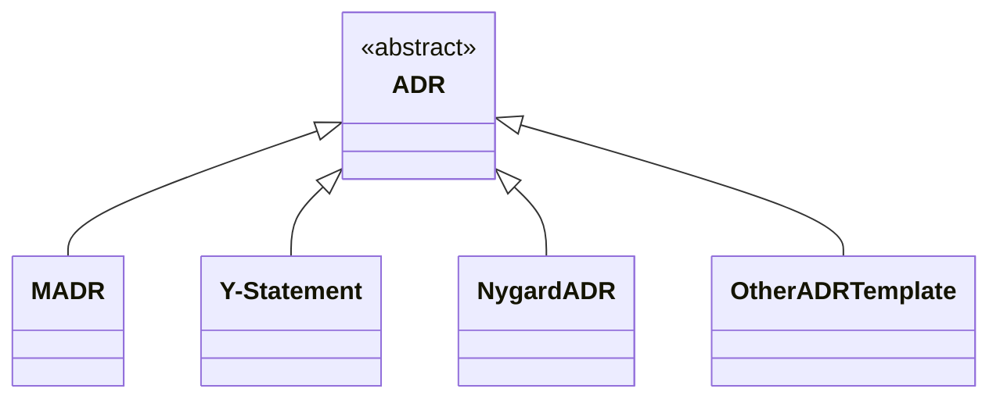

# Architectural Decision Records (ADRs)

## Motivation and Definitions

An [Architectural Decision (AD)](https://en.wikipedia.org/wiki/Architectural_decision) is a justified design choice that addresses a functional or non-functional requirement that is architecturally significant.
An [Architecturally Significant Requirement (ASR)](https://en.wikipedia.org/wiki/Architecturally_significant_requirements) is a requirement that has a measurable effect on the architecture and quality of a software and/or hardware system.
An *Architectural Decision Record (ADR)* captures a single AD and its rationale;
the collection of ADRs created and maintained in a project constitute its *decision log*.
All these are within the topic of Architectural Knowledge Management (AKM), but ADR usage can be extended to design and other decisions ("any decision record").

The aim of the [GitHub adr organization](https://github.com/adr) is to:

1. Motivate the need for and benefits of AD capturing and establish a common vocabulary.
2. Strengthen the tooling around ADRs, in support of agile practices as well as iterative and incremental engineering processes.
3. Provide pointers to public knowledge in the context of AKM and ADRs.

<!-- > Note: The term "architecture decision record" can be used interchangeably. -->

The repository for the Website of the ADR organization is [https://github.com/adr/adr.github.io](https://github.com/adr/adr.github.io).

## ADRs in the Media

- The [Azure Well-Architected Framework](https://learn.microsoft.com/en-us/azure/well-architected/architect-role/architecture-decision-record) at Microsoft Ignite features ADRs and this website (10/11/2024).
- [Love Unrequited: The Story of Architecture, Agile, and How Architecture Decision Records Brought Them Together](https://ieeexplore.ieee.org/document/9801811), Michael Keeling in the Pragmatic Designer column of IEEE Software Vol. 39 Issue 4 (2022) ([PDF](https://ieeexplore.ieee.org/stamp/stamp.jsp?arnumber=9801811))
- Architectural decision capturing is positioned as one of the essential activities in [Design Practice Reference](https://leanpub.com/dpr), a LeanPub e-Book.
- Chapter 3 of ["Patterns for API Design: Simplifying Integration with Loosely Coupled Message Exchanges"](https://api-patterns.org/book/) in the Addison Wesley Signature Series at Pearson features six narratives guiding through the conceptual level of API design: 29 recurring decisions with  options and criteria. Learn more in this [blog post](https://medium.com/nerd-for-tech/api-patterns-website-redesigned-and-sample-book-chapter-available-df9daf4b5e15).
- (in German) [Gut dokumentiert: Architecture Decision Records](https://www.heise.de/hintergrund/Gut-dokumentiert-Architecture-Decision-Records-4664988.html) by [@obfischer](https://github.com/obfischer) published at [heise online](https://www.heise.de/).

{: .long}
<!-- markdownlint-disable-next-line MD022 -->
## ADRs in a Nutshell <!-- Lightweight ADRs Should be Adopted -->

A "lightweight" ADR consists of [title, status, context, decision, and consequences](https://github.com/joelparkerhenderson/architecture-decision-record/blob/main/locales/en/templates/decision-record-template-by-michael-nygard/index.md) according to [@mtnygard](https://github.com/mtnygard). <!-- From Nygard post: "Context This section describes the forces at play, including technological, political, social, and project local." -->

<!-- 
[ThoughtWorks](https://www.thoughtworks.com/) listed architectural decision records as "adopt" at their [technology radar vol. 18](https://assets.thoughtworks.com/assets/technology-radar-vol-18-en.pdf): <https://www.thoughtworks.com/en-us/radar/techniques/lightweight-architecture-decision-records> 
-->

We think that the considered options with their pros and cons are also crucial to understand the reason of a chosen option. [MADR](https://adr.github.io/madr/). Therefore, the Markdown Any/Architectural Decision Records (MADR, pronounced `[ˈmæɾɚ]`) project, located in the adr organization at GitHub, includes such tradeoff analysis information. It also adds additional metadata.

## Relation of Nygardian ADRs, MADR, and Other Templates

## Sustainable Architectural Decisions

The work in the adr organization is based on the guidelines and principles in [Sustainable Architectural Decisions](https://www.infoq.com/articles/sustainable-architectural-design-decisions) by Zdun et al., for instance the Y-statement format suggested in that article.

## Existing ADR Templates

Many ADR formats exist, as shown at [@joelparkerhenderson's repository](https://github.com/joelparkerhenderson/architecture_decision_record):

<!-- - Overview: [Architectural Decision Records](https://github.com/joelparkerhenderson/architecture_decision_record): collection of markdown (?) templates converted to Markdown -->
- [MADR](https://adr.github.io/madr/): The Markdown Architecture Decision Records (MADR: `[ˈmæɾɚ]`). Lean ADRs to quickly document architectural decisions in code. Slogan: architectural decisions that [matter `[ˈmæɾɚ]`](https://en.wiktionary.org/wiki/matter#Pronunciation).
- [DecisionCapture](https://schubmat.github.io/DecisionCapture/): Templates for agile projects and explanation of the ADR universe, with [example](https://github.com/schubmat/DecisionCapture/blob/master/samples/samples_merged/samples_simpleTemplate_secondSprint.md).
- cards42 has adopted the Y-statement template in its German [ADR card](https://cards42.org#adr); the English version is similar, but adds state information.
- The [42010 architecture description (AD) template](http://www.iso-architecture.org/42010/templates/) for [ISO/IEC/IEEE 42010:2011](https://en.wikipedia.org/wiki/ISO/IEC_42010), the international standard for architecture descriptions of systems and software, suggests nine information items for ADRs its Appendix A. It also identifies areas to consider when identifying key decisions.

A comparison of seven templates can be found in ["Architectural Decision Guidance Across Projects --- Problem Space Modeling, Decision Backlog Management and Cloud Computing Knowledge"](https://www.ost.ch/fileadmin/dateiliste/3_forschung_dienstleistung/institute/ifs/cloud-application-lab/admentor-wicsa2015ubmissionv11nc.pdf), a WICSA 2015 conference paper.

### Y-Statements 

In short, the Y-statement is as follows:

> In the context of `<use case/user story u>`, facing `<concern c>` we decided for `<option o>` to achieve `<quality q>`, accepting `<downside d>`.

The long form of it is as follows (extra section "because"):

> In the context of `<use case/user story u>`,
> facing `<concern c>`
> we decided for `<option o>`
> and neglected `<other options>`,
> to achieve `<system qualities/desired consequences>`,
> accepting `<downside d/undesired consequences>`,
> because `<additional rationale>`.

You can find more explanations and examples on Medium: [Y-Statements - A Light Template for Architectural Decision Capturing](https://medium.com/@docsoc/y-statements-10eb07b5a177).

## Decision Capturing Tools

*Disclaimer:*
The following list is rather inclusive.
Please find out about the status and the maturity of the list entries for yourself by following the links.
We are happy to include more candidate assets here.

- [adr-manager](https://adr.github.io/adr-manager/#/): Craft MADR 2.x templates directly in the Web Browser.
- [adr-tools](https://github.com/npryce/adr-tools) - bash scripts to manage ADRs in the [Nygard format](https://cognitect.com/blog/2011/11/15/documenting-architecture-decisions.html). [example](https://github.com/npryce/adr-tools/blob/master/doc/adr/0002-implement-as-shell-scripts.md).
  - Ansible script to install adr-tools: [ansible-adr-tools](https://github.com/escalate/ansible-adr-tools)
  - C# rewrite: [adr-cli](https://github.com/GingerTommy/adr-cli)
  - Go rewrite: [adr](https://github.com/marouni/adr)
  - Java rewrite: [adr-j](https://github.com/adoble/adr-j)
  - ESM Node.js port: [adr-tools](https://github.com/meza/adr-tools)
  - Node.js rewrite: [adr](https://github.com/phodal/adr)
  - PHP version: [phpadr](https://github.com/globtec/phpadr)
  - Powershell module: [adr-ps](https://github.com/rdagumampan/adr-ps)
  - Python rewrite: [adr-tools-python](https://pypi.org/project/adr-tools-python/)
  - Another Powershell module: [ArchitectureDecisionRecords](https://github.com/ajoberstar/ArchitectureDecisionRecords)
  - Rust rewrite: [adrs](https://github.com/joshrotenberg/adrs)
- [adr-plugin](https://github.com/backstage/community-plugins/tree/main/workspaces/adr/plugins/adr) - plugin to explore and search ADRs within a backstage based developer portal. Search at scale across mutliple orgs/repos.
- [adr-viewer](https://github.com/mrwilson/adr-viewer) - python application to generate a website from a set of ADRs.
- [architectural-decision](https://github.com/cspray/architectural-decision): PHP library to create ADRs using PHP8 Attributes.
- [dotnet-adr](https://github.com/endjin/dotnet-adr) - A cross platform .NET Global Tool for creating and managing Architectural Decision Records (ADR).
- [Embedded Architectural Decision Records](https://github.com/adr/e-adr#embedded-architectural-decision-records), which shows how a distributed AD log can be embedded in Java Code via ADR annotations.
- [Log4brains](https://github.com/thomvaill/log4brains): CLI and web UI to log and publish your ADRs as a static website. Currently in [low maintenance mode](https://github.com/thomvaill/log4brains/discussions/108#discussioncomment-7607483).
- [Loqbooq](https://loqbooq.app): Web App with Slack integration to record ADR-inspired decision logs
- [Talo](https://github.com/canpolat/talo): CLI (and dotnet tool) to manage and export ADRs, RFCs and custom software design document types.

For a more detailed list for tooling for MADR, please head to <https://adr.github.io/madr/tooling.html>.

### Tooling related to architecture management

- [ArchUnit](https://github.com/TNG/ArchUnit): unit tests for architecture
- [docToolchain](https://doctoolchain.github.io/docToolchain/): docToolchain is an implementation of the [docs-as-code](https://www.writethedocs.org/guide/docs-as-code/) approach for software architecture plus some additional automation.
- [Structurizr](https://www.structurizr.com/): Structurizr is a collection of tooling to help you visualise, document and explore your software architecture using the [C4 model](https://c4model.com/).

### Interesting, but unmaintained tooling

- [adr-log](https://github.com/adr/adr-log): Generates an architectural decision log out of MADRs.
- [ADMentor](https://github.com/IFS-HSR/ADMentor) Architectural Decision Modeling Add-In for [Sparx Enterprise Architect](https://www.sparxsystems.de/uml/neweditions/)
- [eadlsync](https://adr.github.io/eadlsync/): Synchronizes embedded architectural decision records with a repository of architectural decisions.
- [SE Repo](https://github.com/adr/serepo): Software Engineering Repository. A repository for versioning software engineering artifacts, which can be architectural decisions, patterns, and others.

## More Information

- [Architectural Decisions — The Making Of](https://www.ozimmer.ch/practices/2020/04/27/ArchitectureDecisionMaking.html) provides a history on architecture decision recording since the late 1990, as well as examples and guidance for provoding decision rationale.
- [Documenting Architecture Decisions](https://cognitect.com/blog/2011/11/15/documenting-architecture-decisions.html) is the blog post by Michael Nygard that popularized the concept.
- [Architectural Decision Records (ADR): Open & Transparent Decision History](https://openpracticelibrary.com/practice/architectural-decision-records-adr/) is a practice in the Open Practice Library.
- An AWS Prescriptive Guidance recommends [using architectural decision records to streamline technical decision-making for a software development project](https://docs.aws.amazon.com/prescriptive-guidance/latest/architectural-decision-records/welcome.html).
- [Architecture Decision Records in Action by Michael Keeling (IBM Watson Group) and Joe Runde (IBM) [YouTube]](https://www.youtube.com/watch?v=41NVge3_cYo) is a presentation that includes empirical numbers.
- [ADRs and Architecture Stories](https://www.developertoarchitect.com/lessons/lesson168.html) is part of a video series by Mark Richards explaining ADRs, starting from Nygard's template.
<!-- - [Work by Daniel Popescu](https://scholar.google.com/citations?user=dASv28sAAAAJ) -->

More pointers and resources can be found on the web page [Architectural Knowledge Management (AKM)](https://www.ost.ch/en/research-and-consulting-services/computer-science/ifs-institute-for-software-new/cloud-application-lab/architectural-knowledge-management-akm).

